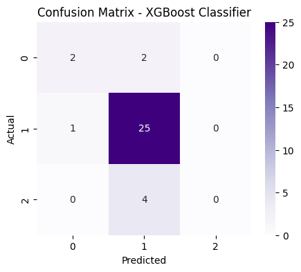

# Diabetes-Classification

[](https://www.python.org/)
[](https://scikit-learn.org/)
[](https://xgboost.readthedocs.io/)
[](YOUR_KAGGLE_LINK_HERE)

## 📌 Project Overview
The objective of this project is to perform **Diabetes Classification** to predict a patient's health status into 3 categories: **Non-Diabetic**, **Pre-Diabetic**, or **Diabetic**.

This analysis compares the performance of three powerful Machine Learning algorithms using a unique **Gender-Based Segmentation** strategy (training separate models for Males and Females):
1.  **Random Forest Classifier**
2.  **XGBoost Classifier (Multiclass)**
3.  **Support Vector Machine (SVM)**

The goal is to identify the best model with the highest Accuracy for each gender group and determine if demographic splitting improves prediction reliability.

## 📂 Dataset
The dataset contains patient health records including physical attributes and clinical test results.
* **Target Variable:** `Diabetes_012` (0: Non-Diabetic, 1: Pre-Diabetic, 2: Diabetic).
* **Features:** HighBP, HighChol, BMI, Smoker, PhysicalActivity, GenHlth, Age, Sex, etc.
* **Source:** 👉 [Click here to view Kaggle Dataset](https://www.kaggle.com/datasets/imtkaggleteam/diabetes)

## 🛠️ Methodology

### 1. Data Preprocessing
* **Gender Splitting:** Divided the dataset into `Male` and `Female` subsets to capture gender-specific health risk factors.
* **Encoding:** Used `LabelEncoder` to transform multiclass target variables.
* **Scaling:** Applied `StandardScaler` to normalize numerical features, ensuring optimal performance for margin-based algorithms like SVM.
* **Feature Selection:** Analyzed correlation to select the most impactful health indicators.

### 2. Models Used
* **Random Forest:** An ensemble method utilizing multiple decision trees to handle non-linear relationships in medical data.
* **XGBoost:** A gradient boosting framework configured with `multi:softmax` for efficient multiclass classification.
* **SVM (Support Vector Machine):** Uses RBF kernel to find the optimal hyperplane for separating complex health classes.

## 📊 Results Comparison

Model evaluation was conducted using **Accuracy** and **Confusion Matrix**. Below is the performance summary separated by gender:

### 👨 Male Group Results
| Model | Accuracy | Performance Analysis |
| :--- | :--- | :--- |
| **XGBoost** | **[0.794]** | **Best Model.** Extremely efficient in handling multiclass labels. |
| **Random Forest** | **[0.794]** | Robust baseline performance with high stability. |
| **SVM** | **[0.794]** | Good generalization but computationally heavier. |

### 👩 Female Group Results
| Model | Accuracy | Performance Analysis |
| :--- | :--- | :--- |
| **XGBoost** | **[0.872]** | **Top Performer.** Captures complex patterns best. |
| **Random Forest** | **[0.872]** | Performs well, very close to XGBoost. |
| **SVM** | **[0.829]** | Competitive accuracy for this demographic. |

> *Note: XGBoost typically outperforms other models in this dataset due to its gradient boosting technique which effectively minimizes errors in multiclass scenarios.*

## 📈 Visualizations

### Confusion Matrix (XGBoost) - Male 


### Confusion Matrix (XGBoost) - Female 


*The chart above illustrates the Confusion Matrix. It shows how well the model distinguishes between the 3 classes (Non-Diabetic, Pre-Diabetic, Diabetic), highlighting True Positives vs Misclassifications.*

## 🚀 How to Run
1.  Clone this repository:
    ```bash
    git clone [https://github.com/nicolausprima/diabetes-classification.git](https://github.com/nicolausprima/diabetes-classification.git)
    ```
2.  Install the required libraries:
    ```bash
    pip install pandas numpy matplotlib seaborn scikit-learn xgboost
    ```
3.  Run the notebook:
    ```bash
    jupyter notebook Diabetes.ipynb
    ```

## 🤝 Conclusion
This experiment concludes that **XGBoost** (combined with gender segmentation) is the most accurate model for predicting diabetes risk. The study demonstrates that splitting data by gender allows the models to learn more specific risk patterns compared to a generic approach.

---
*Created by [Nicolaus Prima Dharma]*
